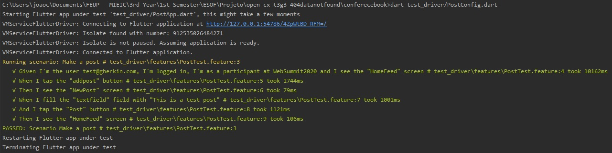

# openCX-*ConferenceBook* Development Report

Welcome to the documentation pages of the *ConferenceBook* of **openCX**!

You can find here detailed about the *ConferenceBook*, hereby mentioned as module, from a high-level vision to low-level implementation decisions, a kind of Software Development Report <!---(see [template](https://github.com/softeng-feup/open-cx/blob/master/docs/templates/Development-Report.md)) -->, organized by discipline (as of RUP): 

* Business modeling 
  * [Product Vision](#Product-Vision)
  * [Elevator Pitch](#Elevator-Pitch)
* Requirements
  * [Use Case Diagram](#Use-case-diagram)
  * [User stories](#User-stories)
  * [Domain model](#Domain-model)
* Architecture and Design
  * [Logical architecture](#Logical-architecture)
  * [Physical architecture](#Physical-architecture)
  * [Prototype](#Prototype)
* [Implementation](#Implementation)
* [Test](#Test)
* [Configuration and change management](#Configuration-and-change-management)
* [Project management](#Project-management)

So far, contributions are exclusively made by the initial team, but we hope to open them to the community, in all areas and topics: requirements, technologies, development, experimentation, testing, etc.

Please contact us! 

Thank you!

- Guilherme Lucas Peralta
- João Carlos Machado Rocha Pires
- João Carlos Ramos Gonçalves de Matos
- Maria Jorge Miranda Loureiro

---

## Product Vision
<!---Start by defining a clear and concise vision for your module, to help members of the team, contributors, and users into focusing their often disparate views into a concise, visual, and short textual form. It provides a "high concept" of the product for marketers, developers, and managers.

**We favor a catchy and concise statement, ideally one sentence.**)--->

<!---
To learn more about how to write a good product vision, please see also:
* [How To Create A Convincing Product Vision To Guide Your Team, by uxstudioteam.com](https://uxstudioteam.com/ux-blog/product-vision/)
* [Product Management: Product Vision, by ProductPlan](https://www.productplan.com/glossary/product-vision/)
* [Vision, by scrumbook.org](http://scrumbook.org/value-stream/vision.html)
* [How to write a vision, by dummies.com](https://www.dummies.com/business/marketing/branding/how-to-write-vision-and-mission-statements-for-your-brand/)
* [20 Inspiring Vision Statement Examples (2019 Updated), by lifehack.org](https://www.lifehack.org/articles/work/20-sample-vision-statement-for-the-new-startup.html)
--->
---

There is always a time in physical or virtual conferences when you wish you could share a thought, experience, or chat with another participant. ConferenceBook is a social network to enhance this communication. Connecting people, towards mind broadening and empowerment of relationships.

## Elevator Pitch
<!---Draft a small text to help you quickly introduce and describe your product in a short time and a few words (~800 characters), a technique usually known as elevator pitch.

Take a look at the following links to learn some techniques:
* [Crafting an Elevator Pitch](https://www.mindtools.com/pages/article/elevator-pitch.htm)
* [The Best Elevator Pitch Examples, Templates, and Tactics - A Guide to Writing an Unforgettable Elevator Speech, by strategypeak.com](https://strategypeak.com/elevator-pitch-examples/)
* [Top 7 Killer Elevator Pitch Examples, by toggl.com](https://blog.toggl.com/elevator-pitch-examples/)
--->
---

Most conferences fail when it comes to communication amongst participants. That's the reason why we created ConferenceBook: an app to make this communication easier than ever, providing participants with a full networking experience. ConferenceBook allows attendees, speakers, organizers and sponsors to interact with each others, by making posts, sharing contacts and interests, and chatting, in a personalized way for each need or taste. Joining ConferenceBook means tapping into a place where all your favourite events are, with tools for knowledge sharing which is exclusive for each event's environment. With ConferenceBook, your event will become more appealing to your participants!

## Requirements

<!---In this section, you should describe all kinds of requirements for your module: functional and non-functional requirements.

Start by contextualizing your module, describing the main concepts, terms, roles, scope and boundaries of the application domain addressed by the project.
--->

### Use case diagram 


#### Login:

* __Actor__: User
* __Description__: This use case exists so that a user can login into ConferenceBook.
* __Preconditions and Postconditions__: In order to sucessfully login, the user must have created an account and use a valid email/password pair. In the end, the user will be able to acess the event's feed.
* __Normal Flow__:
  i) User types email/password
  ii) System validates email/password pair
  iii) System will show the event's feed
* __Alternative Flows and Exceptions__:
  i) User types email/password
  ii) System validates email/password pair and emmits error message
  * __OR__
  i) User types email/password
  ii) System validates email/password pair
  iii) If it is the first time the user accesses ConferenceBook, the system will redirect user to a page where the user should insert the event's code

#### Show conference participants:

* __Actor__: User
* __Description__: This use case exists so that a user can see every other user on the event and, if he wishes, display another user's profile.
* __Preconditions and Postconditions__: In order to access the user's list, the user must be logged in and have access to the event in question. In the end, a user's list will be displayed.
* __Normal Flow__:
  i) User's list is displayed 
* __Alternative Flows and Exceptions__:
  i) User's list is displayed 
  ii) User clicks another user's profile
  iii) The clicked profile is displayed

#### Edit "My Profile"
* __Actor__: User
* __Description__: This use case exists so that a user can add or update information in his profile.
* __Preconditions and Postconditions__: In order to edit his profile, the user must be logged in and add new information in his profile. In the end, the user's profile will be updated.
* __Normal Flow__:
  i) User's current profile is displayed
  ii) User adds/updates information on his profile
  iii) User validates the changes
  iv) System saves the new information
* __Alternative Flows and Exceptions__:
  i) User's current profile is displayed
  ii) User adds/updates information on his profile
  iii) User doesn't validate the changes
  iv) System keeps the old information

#### See ConferenceBook feed
* __Actor__: User
* __Description__: This use case exists so that a user can see, by inverse order of posting, all the posts in the ConferenceBook feed, using the infinite scroll technique.
* __Preconditions and Postconditions__: In order to see the feed, the user must be logged in, have access to the event in question and scroll through out the posts. In the end, the user will have catched up on as many posts as he wishes.
* __Normal Flow__:
  i) System shows event's feed
  ii) User scrolls down to see past publications
  iii) The system will keep showing older publications as long as the user keeps scrolling and there are more publications to be shown
* __Alternative Flows and Exceptions__:
  i) System shows event's feed
  ii) User scrolls up to refresh to newer publications
  iii) The system will show the new posts which have been made between the moment the user got to the feed page and the moment he refreshed the feed

#### Chat with other users
* __Actor__: User
* __Description__: This use case exists so that a user can respond a conversation initiated by a Participant. This means that a Sponsor cannot be the one initiating a conversation, but he can keep it going.
* __Preconditions and Postconditions__: In order to chat with other users, the user must be logged in, have access to the event in question and respond to the other user's message. In the end, a dialogue between two users will have been made and the conversation record will stay on the chat.
* __Normal Flow__:
  i) System pops a message through chat
  ii) User reads and responds the message
  iii) User hits 'Send'
  iv) System sends the message
* __Alternative Flows and Exceptions__:
  i) System pops a message through chat
  ii) User reads and responds the message
  iii) User doesn't hit 'Send'
  iv) System doesn't send the message
  * __OR__
  i) System pops a message through chat
  ii) User reads the message

#### Like posts
* __Actor__: User
* __Description__: This use case exists so that a user can like a post made by another user.
* __Preconditions and Postconditions__: In order to like posts, the user must be logged in and have access to the event in question. In the end, a like from the user will appear on the post
* __Normal Flow__:
  i) User clicks like button
  ii) System adds like to the publication
* __Alternative Flows and Exceptions__:
  i) User unclicks like button
  ii) System removes like from the publication


#### Post/comment (limited)
* __Actor__: Sponsor
* __Description__: This use case exists so that a sponsor can post/comment on the ConferenceBook feed while, at the same time, preventing him from overloading the feed with publicity. As is, the sponsor will have a limited amount of posts/comments he can make (unless the sponsor is responding to comments on his own post)
* __Preconditions and Postconditions__: In order to post/comment posts on an event, the sponsor must be logged in and have his sponsorship validated. In the end, posts and comments made by the sponsor will appear on the feed.
* __Normal Flow__:
  i) System shows a place to post/comment
  ii) Sponsor posts/comments something
  iii) Sponsor hits 'post'/'comment'
  iv) System posts/comments a publication
* __Alternative Flows and Exceptions__:
  i) System shows a place to post/comment
  ii) Sponsor posts/comments something
  iii) Sponsor doesn't hits 'post'/'comment'
  iv) System doesn't posts/comments a publication
  * __OR__
  i) System shows a place to post/comment
  ii) Sponsor posts/comments/ something
  iii) Sponsor hits 'post'/'comment', but the maximum of posts/comments has been achieved
  iv) System displays error message

#### Post/comment
* __Actor__: Participant
* __Description__: This use case exists so that a participant can post/comment photographs, videos and/or text on the ConferenceBook feed
* __Preconditions and Postconditions__: In order to post and comment posts on an event, the participant must be logged in and have access to the event in question. In the end, posts and comments made by the participant will appear on the feed.
* __Normal Flow__:
  i) System shows a place to post/comment
  ii) Participant posts/comments something
  iii) Participant hits 'post'/'comment'
  iv) System posts/comments a publication
* __Alternative Flows and Exceptions__:
  i) System shows a place to post/comment
  ii) Participant posts/comments something
  iii) Participant doesn't hits 'post'/'comment'
  iv) System doesn't posts/comments a publication

#### Initiate a private conversation
* __Actor__: Participant
* __Description__: This use case exists so that a participant can initiate a private conversation with another user on the ConferenceBook's chat.
* __Preconditions and Postconditions__: In order to initiate a private conversation, the participant must be logged in and have access to the event in question. In the end, the participant will have started a conversation with another user
* __Normal Flow__:
  i) Participant opens chat with another user
  ii) Participant types a message
  iii) Participant hits 'send'
  iv) System sends the message
* __Alternative Flows and Exceptions__:
  i) Participant opens chat with another user
  ii) Participant types a message
  iii) Participant doesn't hit 'send'
  iv) System doesn't send the message


#### Moderate posts
* __Actor__: Organizer
* __Description__: This use case exists so that an organizer can moderate the posts (delete or manage spam posts) on the ConferenceBook feed.
* __Preconditions and Postconditions__: In order to moderate the post, the organizer must be logged in. In the end, there won't be hatred nor spam posts on the ConferenceBook feed.
* __Normal Flow__:
  i) Moderator finds a hatred post
  ii) Moderador clicks delete button
  iii) System deletes the post
  iv) System notifies user of the deletion of his post
* __Alternative Flows and Exceptions__:
  i) Moderator finds a spam post
  ii) Moderador warns sponsor


<!---Create a use-case diagram in UML with all high-level use cases possibly addressed by your module.

Give each use case a concise, results-oriented name. Use cases should reflect the tasks the user needs to be able to accomplish using the system. Include an action verb and a noun. 

Briefly describe each use case mentioning the following:

* **Actor**. Name only the actor that will be initiating this use case, i.e. a person or other entity external to the software system being specified who interacts with the system and performs use cases to accomplish tasks. 
* **Description**. Provide a brief description of the reason for and outcome of this use case, or a high-level description of the sequence of actions and the outcome of executing the use case. 
* **Preconditions and Postconditions**. Include any activities that must take place, or any conditions that must be true, before the use case can be started (preconditions) and postconditions. Describe also the state of the system at the conclusion of the use case execution (postconditions). 

* **Normal Flow**. Provide a detailed description of the user actions and system responses that will take place during execution of the use case under normal, expected conditions. This dialog sequence will ultimately lead to accomplishing the goal stated in the use case name and description. This is best done as a numbered list of actions performed by the actor, alternating with responses provided by the system. 
* **Alternative Flows and Exceptions**. Document other, legitimate usage scenarios that can take place within this use case, stating any differences in the sequence of steps that take place. In addition, describe any anticipated error conditions that could occur during execution of the use case, and define how the system is to respond to those conditions. 
--->

### User stories

 In the following sections, roles for every user story are described and an user story map is presented, allowing a more global view of all the user stories of this project.

 User story and their mockups are present in the comments of each issue in GitHub Projects, as well as the acceptance tests for each one of them.
 
 The link for our board can be found [here](https://github.com/FEUP-ESOF-2020-21/open-cx-t3g3-404datanotfound/projects/1).

#### Users

General role, includes every user of the conference, be it attendee, speaker, organizer or sponsor.

#### Participants (including attendees, speakers and organizers)

This role includes attendees, speakers and organizers of the conference, since they will have the same funcionalities while using the app. In addition, organizers will have an extent of this role, since they will have additional funciontalities, explained bellow.

#### Organizers

This roll will be assigned to the organizers of each conference. Naturally, they will play an important role in moderating the feed and helping participants with anything they need.

#### Sponsors

This roll will belong to representatives of organizations or institutions that will be present at the event. In this sense, they will have different objectives from the attendees and, therefore, different actions.

#### User Story Map


### Domain model

Conferencebook is built on top of the well-known concept of social network. However, unlike most social networks, it is restricted to the ones present in a conference, which must be registered in Conferencebook.

* Each **conference** has an id, name, and code. Each conference participant is given, *a priori*, a specific code for the conference and role to be taken, which can be of Attendee, Speaker, Sponsor, or Organizer. Therefore, each conference has a set of codes, for registration: codeForAttendee, codeForSpeaker, codeForSponsor, and codeForOrganizer.
 
* A **user** can create an account in Conferencebook as usually done in similar platforms, with email and password, and can construct his profile with information of interest to other participants, such as: area of work, short biography, city of living, interests, and job. For an enhanced connectivity with existing platforms for communication and knowledge sharing, users can add to their profile the nicknames for: LinkedIn, Facebook, Instagram, GitHub, and Twitter. A profile picture can also be included. A user is associated to each conference with the role played, thus enabling the possibility of playing different roles in different conferences. Conferences can have as many users as wished, and users can join as many conferences as wished, too.

* An unlimited number of **posts** can be done, associated to each conference. Each post has a date and time, stating when it was created; the user who creates the post is also saved. The post itself can contain text and/or multimedia: a photo or a video. Similarly to what happens in any social network, the app users can leave a like or a comment. Therefore, each post has a number of Likes and Comments saved. Each post is associated to a single conference.

* Associated to each post, and unlimited number of **comments** can exist. Similarly to what happens for posts, each comment can be created by a single user, responding to a single post, and has a date and time, a number of Likes, and a text, containg the message.


<!--To better understand the context of the software system, it is very useful to have a simple UML class diagram with all the key concepts (names, attributes) and relationships involved of the problem domain addressed by your module.-->

---

## Architecture and Design
<!--The architecture of a software system encompasses the set of key decisions about its overall organization. 

A well written architecture document is brief but reduces the amount of time it takes new programmers to a project to understand the code to feel able to make modifications and enhancements.

To document the architecture requires describing the decomposition of the system in their parts (high-level components) and the key behaviors and collaborations between them. 

In this section you should start by briefly describing the overall components of the project and their interrelations. You should also describe how you solved typical problems you may have encountered, pointing to well-known architectural and design patterns, if applicable.-->

### Logical Architecture

The best approach towards the simplification of the project structure is the MVC approach.

#### Package Diagram

The Event_Specific package includes items for event management and moderation.

The Profile package contains the files regarding the profile information management and as such depends on the Login and the Create_Account packages, which are, respectively, responsible for the files relating the login and the account creation actions.

The Feed Package includes items related with the display and storing of the home feed information. It depends on both the Event-Specific and the Profile packages, as information regarding the profile and relative to event characteristics (for example, the event moderation settings) are crucial for the home feed publications.


### Physical Architecture

Our project's physical structure is very simple. The user installs ConferenceBook on their smartphone, and whenever the need to connect with our database arises, it communicates with it via HTTPS requests, where it will store and retrieve all the information needed.

With this in mind, we wrote a general Deployment Diagram, with the two devices that compose our system.

Our project was fully developed using Flutter - an emerging framework for mobile development that supports both iOS and Android - combined with Firebase to store participants and conferences data. We used Firebase for our database server because of its easy integration with flutter, as well as simple setup.

#### Deployment Diagram


<!--The goal of this subsection is to document the high-level physical structure of the software system (machines, connections, software components installed, and their dependencies) using UML deployment diagrams or component diagrams (separate or integrated), showing the physical structure of the system.

It should describe also the technologies considered and justify the selections made. Examples of technologies relevant for openCX are, for example, frameworks for mobile applications (Flutter vs ReactNative vs ...), languages to program with microbit, and communication with things (beacons, sensors, etc.).-->

---

## Test

<!--There are several ways of documenting testing activities, and quality assurance in general, being the most common: a strategy, a plan, test case specifications, and test checklists.

In this section it is only expected to include the following:
* test plan describing the list of features to be tested and the testing methods and tools;
* test case specifications to verify the functionalities, using unit tests and acceptance tests.
 
A good practice is to simplify this, avoiding repetitions, and automating the testing actions as much as possible.-->

The features to be tested are the following ones:

* [Login](https://github.com/FEUP-ESOF-2020-21/open-cx-t3g3-404datanotfound/issues/7)
* [Insert an Event Code](https://github.com/FEUP-ESOF-2020-21/open-cx-t3g3-404datanotfound/issues/29)
* [Make a Post](https://github.com/FEUP-ESOF-2020-21/open-cx-t3g3-404datanotfound/issues/16)

The reason why we decided to test these features is because we consider them to be among the most important ones in our application:
- **Login** is the starting point of the app and the responsible one for the authentication of an user
- **Insert an event code** represents the only way to access all functionalities of the app. 
- **Making a post** represents one possible interaction with the app, and possible the most important one.

The implementation of the acceptance tests for these features was done with **Gherkin**, with the aid of ```flutter_gherkin``` package for Flutter.

The automation of these tests is the following:

**Feature: Login**

User should be able to login using an email and password.

**Scenario: User do a successful login with an email and password**
     
     - Given I'm in the "Login" screen
     - When I fill the "emailfield" field with "teste@gherkin.com"
     - And I fill the "passwordfield" field with "123456"
     - And I tap the "loginbutton" button
     - Then I see the "JoinAnEvent" screen

**Feature: New Event**

User should be able to enter in a new event by inserting a valid code.

**Scenario: Enter in a new event**
     
     - Given I'm the user test@gherkin.com, I'm logged in and I see the "JoinAnEvent" screen
     - When I tap the "neweventcode" button
     - Then I see the "EnterEventCode" screen
     - When I fill the "eventcodefield" field with "WS2020Attendee"
     - And I tap the "entereventcode" button
     - Then I see the "HomeFeed" screen

**Feature: Post**

User should be able to make a new post from the HomeFeed of some event.

**Scenario: Make a post**
     
     - Given I'm the user test@gherkin.com, I'm logged in, I'm as a participant at WebSummit2020 and I see the "HomeFeed" screen
     - When I tap the "addpost" button
     - Then I see the "NewPost" screen
     - When I fill the "textfield" field with "This is a test post"
     - And I tap the "Post" button
     - Then I see the "HomeFeed" screen
     
Note: The test above only succeed if the organizers of the conference used for the test didn't block new posts.

The results of the tests were the following:




The demo of the tests is the following:


Note: The above GIF is the composition of all the tests, which were runned independently.

---

## Project management

The tool used for Project Management was GitHub Projects. The link for our board can be found [here](https://github.com/FEUP-ESOF-2020-21/open-cx-t3g3-404datanotfound/projects/1).
